  

  

  
  

---

## 👨‍💻 Sobre mim

Sou estudante de **Ciência da Computação** e estou construindo minha base em desenvolvimento de software, estruturas de dados, banco de dados e desenvolvimento web.

Atualmente tenho interesse em:

- desenvolvimento web moderno;
- Java, C e JavaScript;
- bancos de dados com PostgreSQL;
- projetos acadêmicos e aplicações reais;
- boas práticas com Git e GitHub.

---

## 🛠 Tech Stack

### 💻 Linguagens

  

### 🌐 Frontend

  

### ⚙️ Backend e Banco de Dados

  

### 🔧 Ferramentas

  

---

## 📊 GitHub Stats

  

<table align="center" width="100%">
  <tr>
    <td align="center" width="50%">
      
    </td>
    <td align="center" width="50%">
      
    </td>
  </tr>
</table>

---

## 🚀 Projetos em destaque

> Em breve vou adicionar aqui meus principais projetos acadêmicos e pessoais.

---

  

